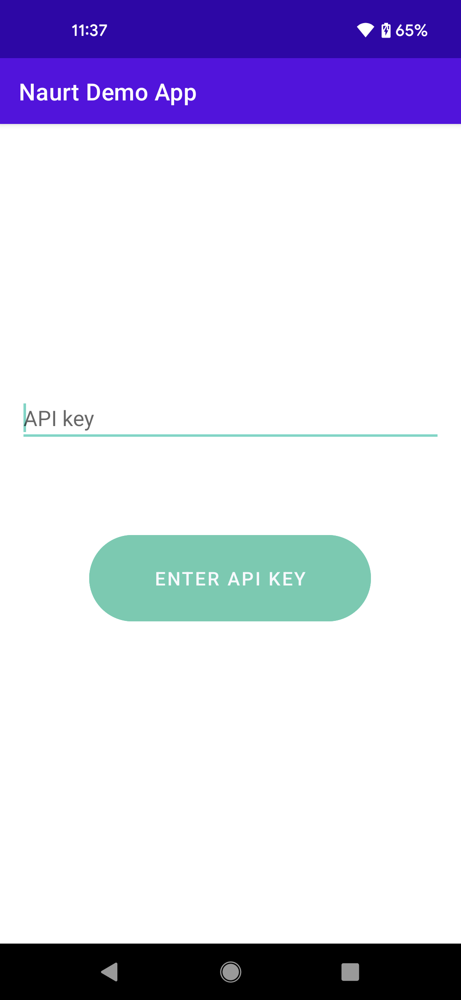
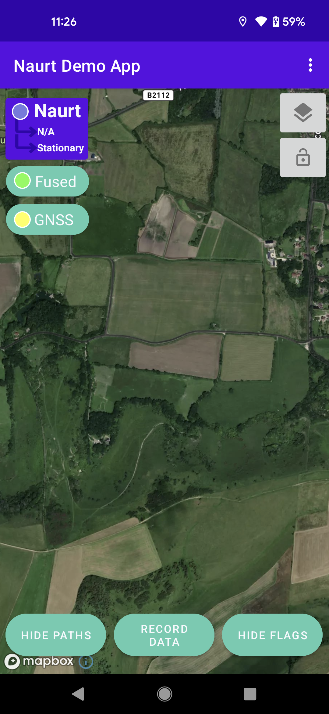
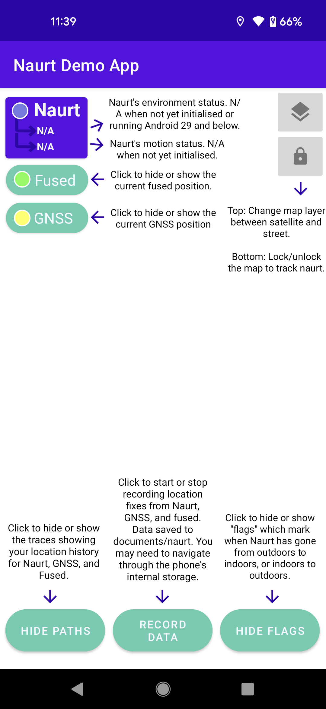

# Naurt Android Demo Application

This app has been built to demonstrate Naurt's capabilities and compare them to GNSS 
and fused. To use the app you'll need an API key. If you don't yet have one, please get in contact with the [sales team](https://www.Naurt.com/#Contact1).

## Quickstart
To get the app up and running all you need to do is download the app, ensure your phone is connected to the internet and enter a valid API key. Make sure to give the app the location permissions it needs otherwise it will not function as intended! If outdoor to indoor tracking is required, the best results will be seen when the phone is in hand rather than a pocket or bag.

#### Example images
Login Screen|Main Screen|Information page
:-------------------------:|:-------------------------:|:-------------------------:
||

## Features
### Traces
The app should mainly be used as a tool for visual inspection. Traces are drawn showing the route taken since opening the app for Naurt, GNSS, and fused. These traces can be completely hidden to just display your current location; or, you can individually toggle GNSS and fused. 

### Flags
The demo app places "flags" on the map when a Naurt event happens. Currently, this just occurs when the Naurt flags the environment has changed, i.e, you go from outdoors to indoors or indoors to outdoors. You'll see this represented on the map by a door icon which can be hidden. This information is also displayed as text in the top left corner of the application.

### Data recording
If you wish to perform some custom analysis on Naurt, the app also provides data collection to a CSV file. Currently, the timestamp, Naurt latitude, Naurt longitude, Naurt speed, Naurt motion flag, Naurt environment flag, GNSS latitude, GNSS longitude, fused latitude, and fused longitude are recorded. The app also functions in the background so data will still be collected when the screen is off. For long collections, this is not 100% reliable as the Mapbox integrations and internet requirements that come with such integrations can cause crashes. Stability will be improved over time. It is also with noting that data will not be collected if there is no documents folder present on the phone.

## Feature Requests
If there are any additional features you require, please create an issue on this repository and we will try our best to accommodate it.

## Bugs
We apologise if you find any bugs within the app, this was developed over a short period to give a first demonstration of what Naurt can do. A few bugs we are aware of:

- Crashes on some phones running Android 10 - API 29
- Sporadic issues with hiding Naurt flags.
- Data recording cannot be stopped (of saved) on phones which have no documents folder (generally older devices).

### Bug reports
if you come across any bugs not mentioned above, please make an issue on this repository and describe your problem. 